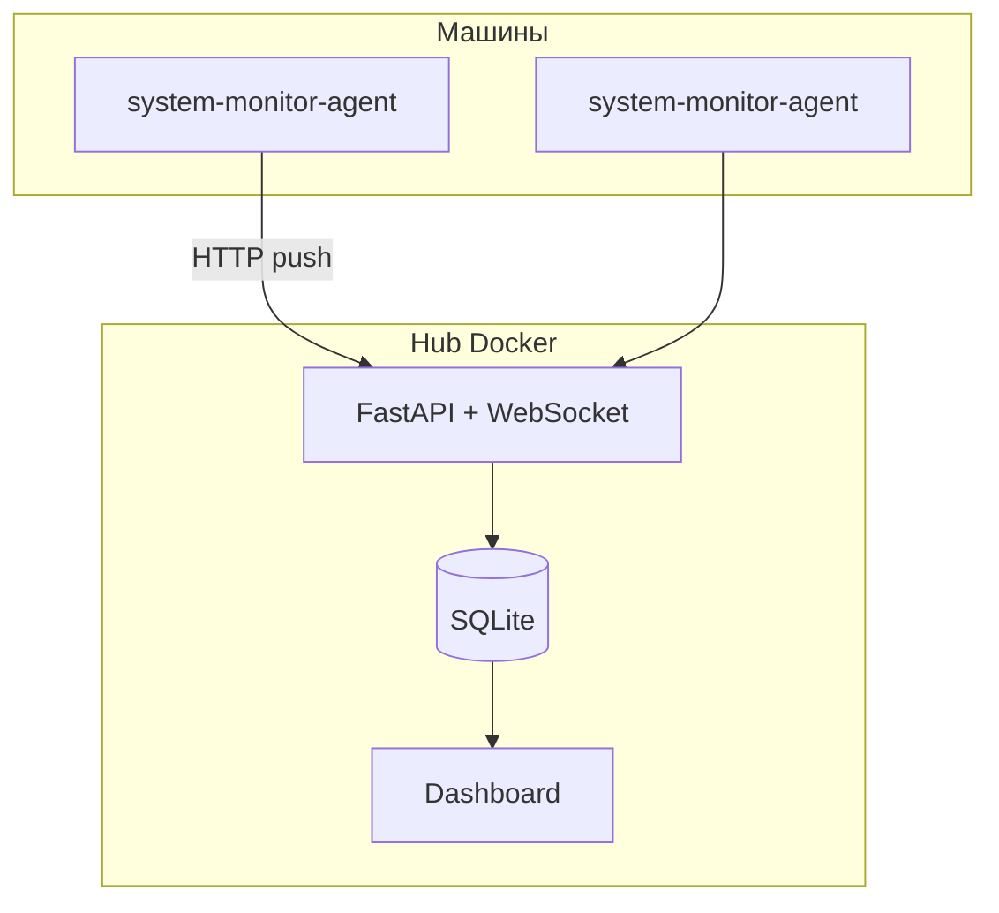
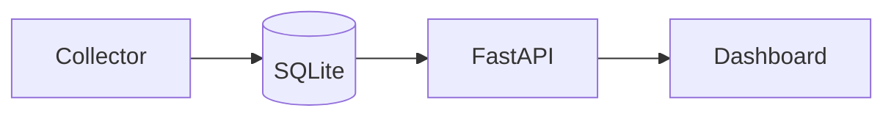

<div align="center">

# system-monitor

**Лёгкая кроссплатформенная система мониторинга с веб-панелью на русском языке**

[](LICENSE)
[](https://www.python.org/)
[](#установка)
[](https://github.com/pagbest154-cmd/system-monitor/releases)

Датчики, графики и пороги — через YAML или веб-интерфейс.  
Live-обновления по WebSocket, история в SQLite.

[Установка](#установка) ·
[Возможности](#возможности) ·
[Скриншот](#интерфейс) ·
[API](#api) ·
[Changelog](CHANGELOG.md)

</div>

---

## Интерфейс


---

## Возможности

| Категория | Что отслеживается |
|-----------|-------------------|
| **Процессор** | Загрузка %, модель, ядра, частота, загрузка по каждому ядру |
| **Память** | RAM, swap, объёмы и проценты |
| **Диски** | HDD / SSD / NVMe, разделы, тома, занятость (автообнаружение всех дисков) |
| **GPU** | Модель, VRAM, загрузка, CUDA (NVIDIA) |
| **Сеть** | Интерфейсы, IP, MAC, трафик ↑↓ |
| **Прочее** | Температура CPU, батарея, uptime |

**Плагины:** HTTP JSON · MQTT · GPIO (Raspberry Pi / DHT22)

**UI:** gauge · линейные графики · столбцы · live WebSocket · страница настроек

---

## Архитектура

**Fleet (hub + agents):**



**Standalone (одна машина):**



---

## Установка

### Hub (Docker) — центральный дашборд

```bash
git clone https://github.com/pagbest154-cmd/system-monitor.git
cd system-monitor
cp .env.example .env
# HUB_NAME и HUB_KEY — имя хаба и ключ для входа в веб-интерфейс
docker compose up -d
```

Образ: `ghcr.io/pagbest154-cmd/system-monitor:latest` · интерфейс: http://127.0.0.1:8080

**Привязка домена (HTTPS):**

```bash
cp .env.example .env
# DOMAIN=monitor.example.com  — DNS A-запись на IP сервера
docker compose --profile domain up -d
```

В настройках hub укажите тот же домен — «URL для агентов» появится автоматически.  
Caddy получит сертификат Let's Encrypt и проксирует на hub.

**Standalone (одна машина):** `docker compose -f docker-compose.standalone.yml up -d`

### Agent — slim-пакет на машинах

**Linux (.deb):**

```bash
sudo apt install ./system-monitor-agent_*_amd64.deb
```

При установке debconf спросит **Hub URL**, **Agent ID** и **token**.  
На hub добавьте агента в [`config/agents.yaml`](config/agents.yaml) с тем же token.

APT-репозиторий (GitHub Pages при релизе):

```bash
echo "deb [trusted=yes] https://pagbest154-cmd.github.io/system-monitor/apt stable main" \
  | sudo tee /etc/apt/sources.list.d/system-monitor.list
sudo apt update
sudo apt install system-monitor-agent
```

**Windows (установщик):**

1. Скачайте `system-monitor-agent_*_setup.exe` из [Releases](https://github.com/pagbest154-cmd/system-monitor/releases).
2. Запустите установщик — укажите **Hub URL**, **Agent ID** и **token** (как debconf на Linux).
3. Агент регистрируется как служба Windows `system-monitor-agent` и стартует автоматически.

| Компонент | Способ | Путь конфигурации |
|-----------|--------|-------------------|
| Hub | Docker | `./config/` + volume `hub-data` |
| Agent (Linux) | apt | `/etc/system-monitor/agent.yaml` |
| Agent (Windows) | setup.exe | `%ProgramData%\system-monitor\agent.yaml` |

Логи службы: `%ProgramData%\system-monitor\agent.log`

### Из исходников (Python)

```bash
git clone https://github.com/pagbest154-cmd/system-monitor.git
cd system-monitor
python -m venv .venv

# Windows
.venv\Scripts\activate

# Linux / macOS
source .venv/bin/activate

pip install -r requirements.txt
pip install ".[hub]"
python -m system_monitor --mode hub --host 0.0.0.0 --port 8080
```

**Agent (dev):**

```bash
pip install -r requirements-agent.txt
pip install .
system-monitor-agent --config config/agent.yaml
```

**Опционально:**

```bash
pip install -r requirements-pi.txt   # GPIO на Raspberry Pi
pip install paho-mqtt                # MQTT-датчики
```

Откройте в браузере: **http://127.0.0.1:8080**

Standalone без fleet: `python -m system_monitor --mode standalone --host 0.0.0.0 --port 8080`

---

## Конфигурация

<details>
<summary><strong>Датчики — <code>config/sensors.yaml</code></strong></summary>

```yaml
settings:
  retention_days: 7
  default_interval_sec: 5

sensors:
  - id: cpu_percent
    name: Загрузка процессора
    type: system.cpu_percent
    enabled: true
    interval_sec: 5
    unit: "%"
    warn_above: 80
    critical_above: 95
```

</details>

<details>
<summary><strong>Панели — <code>config/dashboard.yaml</code></strong></summary>

```yaml
dashboard:
  title: Мониторинг системы
  refresh_sec: 3

panels:
  - id: cpu_gauge
    title: Процессор
    type: gauge
    sensors: [cpu_percent]
    col: 1
    row: 1
```

</details>

---

## Типы датчиков

| Тип | Описание |
|-----|----------|
| `system.cpu_percent` | Загрузка CPU (%) |
| `system.memory_percent` | Использование RAM (%) |
| `system.disk_usage` | Занятость диска (`params.path`) |
| `system.network_bytes` | Сеть МБ/с (`params.direction`: recv/sent) |
| `system.temperature` | Температура CPU |
| `gpio.dht22` | DHT22 на Raspberry Pi (`params.pin`) |
| `remote.http_json` | HTTP API (`params.url`, `params.json_path`) |
| `remote.mqtt` | MQTT-топик (`params.topic`, `params.broker`) |

> Диски также обнаруживаются автоматически — отдельный датчик на каждый том (`disk_auto_*`).

---

## API

| Метод | Путь | Описание |
|-------|------|----------|
| GET | `/api/hub/info` | Домен и public URL hub |
| GET | `/api/config/hub` | Конфиг домена |
| PUT | `/api/config/hub` | Сохранить домен |
| GET | `/api/mode` | Режим: `standalone` / `hub` |
| GET | `/api/agents` | Список агентов (hub) |
| GET | `/api/agents/{id}/system` | Snapshot железа агента |
| POST | `/api/agents/{id}/metrics` | Ingest метрик (agent, Bearer token) |
| POST | `/api/agents/{id}/config` | SyncConfig overrides (agent) |
| GET | `/api/sensors?agent=` | Датчики агента |
| GET | `/api/metrics/{id}?agent=` | История метрик агента |
| GET | `/api/sensors` | Список датчиков и текущие значения |
| GET | `/api/metrics/{id}?period=1h` | История метрик |
| GET | `/api/system` | Информация о железе (CPU, RAM, диски, GPU…) |
| GET | `/api/dashboard` | Конфигурация панелей |
| PUT | `/api/config/sensors` | Обновить датчики |
| PUT | `/api/config/dashboard` | Обновить панели |
| WS | `/ws/live` | Live-обновления |

---

<div align="center">

**[Changelog](CHANGELOG.md)** · **[Security](SECURITY.md)** · **[License](LICENSE)**

Сделано с ❤️ для мониторинга своих серверов и ПК

</div>
