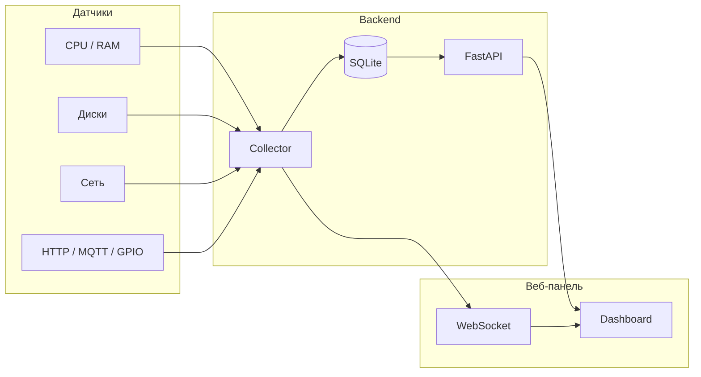

<div align="center">

# system-monitor

**Лёгкая кроссплатформенная система мониторинга с веб-панелью на русском языке**

[](LICENSE)
[](https://www.python.org/)
[](#установка)
[](https://github.com/pagbest154-cmd/system-monitor/releases)

Датчики, графики и пороги — через YAML или веб-интерфейс.  
Live-обновления по WebSocket, история в SQLite.

[Установка](#установка) ·
[Возможности](#возможности) ·
[Скриншот](#интерфейс) ·
[API](#api) ·
[Changelog](CHANGELOG.md)

</div>

---

## Интерфейс


---

## Возможности

| Категория | Что отслеживается |
|-----------|-------------------|
| **Процессор** | Загрузка %, модель, ядра, частота, загрузка по каждому ядру |
| **Память** | RAM, swap, объёмы и проценты |
| **Диски** | HDD / SSD / NVMe, разделы, тома, занятость (автообнаружение всех дисков) |
| **GPU** | Модель, VRAM, загрузка, CUDA (NVIDIA) |
| **Сеть** | Интерфейсы, IP, MAC, трафик ↑↓ |
| **Прочее** | Температура CPU, батарея, uptime |

**Плагины:** HTTP JSON · MQTT · GPIO (Raspberry Pi / DHT22)

**UI:** gauge · линейные графики · столбцы · live WebSocket · страница настроек

---

## Архитектура



---

## Установка

### Debian / Ubuntu (.deb)

Скачать `.deb` из [релизов](https://github.com/pagbest154-cmd/system-monitor/releases):

```bash
sudo apt install ./system-monitor_*_amd64.deb
```

Или подключить APT-репозиторий (публикуется на GitHub Pages при релизе):

```bash
echo "deb [trusted=yes] https://pagbest154-cmd.github.io/system-monitor/apt stable main" \
  | sudo tee /etc/apt/sources.list.d/system-monitor.list
sudo apt update
sudo apt install system-monitor
```

Для публикации APT-репозитория через GitHub Actions:

1. **Settings → Pages → Source: GitHub Actions**
2. **Settings → Environments → github-pages → Deployment branches and tags** → добавить тег `v*`

После установки сервис запускается автоматически:

```bash
sudo systemctl status system-monitor
```

| Путь | Назначение |
|------|------------|
| `/etc/system-monitor/` | Конфигурация |
| `/var/lib/system-monitor/` | Данные SQLite |
| `http://127.0.0.1:8080` | Веб-интерфейс |

### Из исходников (Python)

```bash
git clone https://github.com/pagbest154-cmd/system-monitor.git
cd system-monitor
python -m venv .venv

# Windows
.venv\Scripts\activate

# Linux / macOS
source .venv/bin/activate

pip install -r requirements.txt
python -m system_monitor
```

**Опционально:**

```bash
pip install -r requirements-pi.txt   # GPIO на Raspberry Pi
pip install paho-mqtt                # MQTT-датчики
```

Откройте в браузере: **http://127.0.0.1:8080**

```bash
python -m system_monitor --host 0.0.0.0 --port 8080
```

---

## Конфигурация

<details>
<summary><strong>Датчики — <code>config/sensors.yaml</code></strong></summary>

```yaml
settings:
  retention_days: 7
  default_interval_sec: 5

sensors:
  - id: cpu_percent
    name: Загрузка процессора
    type: system.cpu_percent
    enabled: true
    interval_sec: 5
    unit: "%"
    warn_above: 80
    critical_above: 95
```

</details>

<details>
<summary><strong>Панели — <code>config/dashboard.yaml</code></strong></summary>

```yaml
dashboard:
  title: Мониторинг системы
  refresh_sec: 3

panels:
  - id: cpu_gauge
    title: Процессор
    type: gauge
    sensors: [cpu_percent]
    col: 1
    row: 1
```

</details>

---

## Типы датчиков

| Тип | Описание |
|-----|----------|
| `system.cpu_percent` | Загрузка CPU (%) |
| `system.memory_percent` | Использование RAM (%) |
| `system.disk_usage` | Занятость диска (`params.path`) |
| `system.network_bytes` | Сеть МБ/с (`params.direction`: recv/sent) |
| `system.temperature` | Температура CPU |
| `gpio.dht22` | DHT22 на Raspberry Pi (`params.pin`) |
| `remote.http_json` | HTTP API (`params.url`, `params.json_path`) |
| `remote.mqtt` | MQTT-топик (`params.topic`, `params.broker`) |

> Диски также обнаруживаются автоматически — отдельный датчик на каждый том (`disk_auto_*`).

---

## API

| Метод | Путь | Описание |
|-------|------|----------|
| GET | `/api/sensors` | Список датчиков и текущие значения |
| GET | `/api/metrics/{id}?period=1h` | История метрик |
| GET | `/api/system` | Информация о железе (CPU, RAM, диски, GPU…) |
| GET | `/api/dashboard` | Конфигурация панелей |
| PUT | `/api/config/sensors` | Обновить датчики |
| PUT | `/api/config/dashboard` | Обновить панели |
| WS | `/ws/live` | Live-обновления |

---

<div align="center">

**[Changelog](CHANGELOG.md)** · **[Security](SECURITY.md)** · **[License](LICENSE)**

Сделано с ❤️ для мониторинга своих серверов и ПК

</div>
