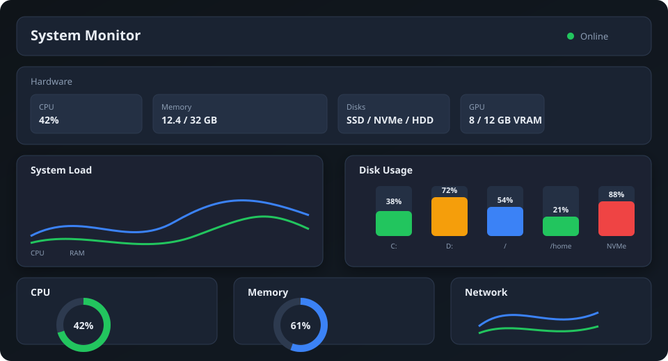
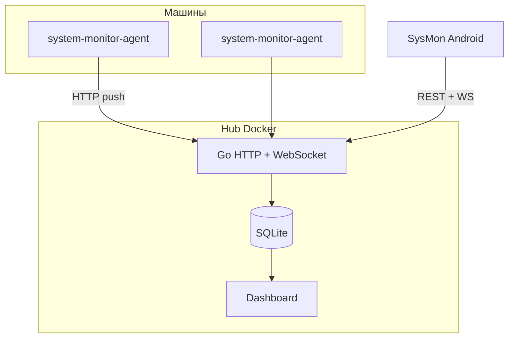
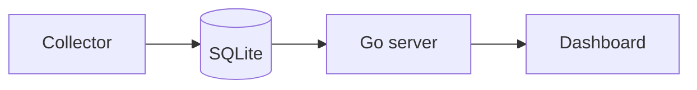

<div align="center">

# system-monitor

**Лёгкая кроссплатформенная система мониторинга с веб-панелью на русском языке**

[](LICENSE)
[](https://go.dev/)
[](#установка)
[](https://github.com/pagbest154-cmd/system-monitor/releases)

Датчики, графики и пороги — через YAML или веб-интерфейс.  
Live-обновления по WebSocket, история в SQLite.

[Установка](#установка) ·
[Документация](docs/README.md) ·
[Android (SysMon)](#android-sysmon) ·
[Возможности](#возможности) ·
[Скриншот](#интерфейс) ·
[API](#api) ·
[Changelog](CHANGELOG.md)

</div>

---

## Интерфейс



---

## Возможности

| Категория | Что отслеживается |
|-----------|-------------------|
| **Процессор** | Загрузка %, модель, ядра, частота, загрузка по каждому ядру |
| **Память** | RAM, swap, объёмы и проценты |
| **Диски** | HDD / SSD / NVMe, разделы, тома, занятость (автообнаружение всех дисков) |
| **GPU** | Модель, VRAM, загрузка, CUDA (NVIDIA) |
| **Сеть** | Интерфейсы, IP, MAC, трафик ↑↓ |
| **Прочее** | Температура CPU, батарея, uptime |

**Плагины:** HTTP JSON · MQTT · GPIO (Raspberry Pi / DHT22)

**UI:** gauge · линейные графики · столбцы · live WebSocket · страница настроек

**Android-клиент SysMon:** панель и список хостов на телефоне · live-метрики · виджет на рабочий стол · настройка ntfy-алертов · автообновление с GitHub Releases

**Уведомления:** push через [ntfy](https://ntfy.sh) — пороги по датчикам, offline-хост, один APK для любого self-hosted hub

---

## Архитектура

**Fleet (hub + agents):**


```mermaid
flowchart TB
    subgraph machines [Машины]
        A1[system-monitor-agent]
        A2[system-monitor-agent]
    end
    subgraph hubHost [Hub Docker]
        API[Go HTTP + WebSocket]
        DB[(SQLite)]
        UI[Dashboard]
    end
    MOB[SysMon Android]
    A1 -->|HTTP push| API
    A2 --> API
    API --> DB
    DB --> UI
    MOB -->|REST + WS| API
```

**Standalone (одна машина):**


```mermaid
flowchart LR
    COL[Collector] --> DB[(SQLite)] --> API[Go server] --> UI[Dashboard]
```

---

## Установка

### Hub (Docker) — центральный дашборд

```bash
git clone https://github.com/pagbest154-cmd/system-monitor.git
cd system-monitor
cp .env.example .env
# HUB_NAME и HUB_KEY — имя хаба и ключ для входа в веб-интерфейс
docker compose up -d
```

Образ: `ghcr.io/pagbest154-cmd/system-monitor:latest` · интерфейс: http://127.0.0.1:8080

**Привязка домена (HTTPS):**

```bash
cp .env.example .env
# DOMAIN=monitor.example.com  — DNS A-запись на IP сервера
docker compose --profile domain up -d
```

В настройках hub укажите тот же домен — «URL для агентов» появится автоматически.  
Caddy получит сертификат Let's Encrypt и проксирует на hub.

**Standalone (одна машина):** `docker compose -f docker-compose.standalone.yml up -d`

**Обновление hub:**

```bash
docker compose pull
docker compose up -d
```

Конкретная версия: `VERSION=1.0.67 docker compose pull && docker compose up -d`  
В футере веб-интерфейса — установленная версия и статус обновления с GitHub.

> На каждом релизе собираются **агенты** (`.deb`, `.exe`), **Android APK** (`sysmon-{version}.apk`) и при изменениях hub-кода — Docker-образ. Смотрите блок «Сборка релиза» в [Releases](https://github.com/pagbest154-cmd/system-monitor/releases).

### Подключение агентов к hub

1. В [`config/agents.yaml`](config/agents.yaml) добавьте агента (id, name, token):

```yaml
agents:
  - id: homepc
    name: Домашний ПК
    token: "длинный-секретный-токен"
    overrides:
      - sensor_id: net_rx
        params: { interface: "Wi-Fi" }
      - sensor_id: net_tx
        params: { interface: "Wi-Fi" }
```

Имя интерфейса — как в блоке **«Сеть»** на дашборде (`eth0`, `wlan0`, `Ethernet`, `Wi-Fi`). Без `interface` считается сумма по всем NIC. Overrides подхватывает агент с hub при sync конфига; локально то же можно задать в `/etc/system-monitor/agent_sensors.yaml`.

2. Установите агент на машине с **тем же** Hub URL, Agent ID и token.
3. На панели hub в выпадающем списке **Хост** выберите агента. Если агентов ещё нет — на панели будет сообщение «Нет зарегистрированных хостов».
4. Агентов можно добавлять и в **Настройки → Агенты** в веб-интерфейсе hub.

Конфиг hub монтируется с хоста: `./config/` (в т.ч. `agents.yaml`, `dashboard.yaml`, `alerts.yaml`).

### Push-уведомления (ntfy)

Хаб шлёт алерты через HTTP POST на [ntfy](https://docs.ntfy.sh/). **Topic** — секрет подписки (как пароль); у каждого хоста свой topic.

**1. Базовый URL ntfy** в `.env`:

```env
# публичный ntfy.sh или свой сервер
NTFY_BASE_URL=https://ntfy.sh
```

**2. Свой ntfy рядом с hub (опционально):**

```bash
docker compose --profile ntfy up -d
# NTFY_BASE_URL=https://ntfy.ваш-домен.ru  (прокси через Caddy)
```

**3. Включить алерты** на странице **Хосты** (колокольчик) или в Android-приложении SysMon:

- пороги по датчикам (push при переходе ниже → выше порога);
- «хост недоступен» после N секунд без связи;
- пауза между повторами (cooldown).

При первом сохранении hub создаёт **topic** автоматически. Его можно скопировать в веб-интерфейсе или подписаться в приложении SysMon (переключатель «Подписка в приложении»).

**4. Подписка без SysMon:** установите [приложение ntfy](https://ntfy.sh) и подпишитесь на topic с веб-панели.

Пример `config/alerts.yaml` (обычно правится через API/UI):

```yaml
alerts:
  homepc:
    enabled: true
    offline:
      enabled: true
      after_sec: 180
    cooldown_sec: 900
    notify_recovery: false
    ntfy:
      topic: sysmon-homepc-a8f3k2...
      token: ""   # опционально, если на ntfy включена авторизация
    webhook:
      url: ""     # опционально: POST JSON при алерте
      secret: ""  # опционально: заголовок X-Sysmon-Secret
    sensors:
      - sensor_id: cpu_percent
        enabled: true
        threshold: 85
```

> Self-hosted hub + свой ntfy = push без Google и без общего Firebase. Один APK SysMon работает с любым hub.

### Agent — slim-пакет на машинах

**Linux (APT-репозиторий):**

```bash
echo "deb [trusted=yes] https://pagbest154-cmd.github.io/system-monitor/apt stable main" \
  | sudo tee /etc/apt/sources.list.d/system-monitor.list
sudo apt update
sudo apt install system-monitor-agent
```

После нового релиза агента сначала снова выполните `sudo apt update` — иначе apt может пытаться скачать старый `.deb` (404).

Автономный **Go**-бинарник — зависимостей runtime на целевой системе нет.  
При первой установке debconf спросит **Hub URL**, **Agent ID** и **token**.  
На hub добавьте агента в [`config/agents.yaml`](config/agents.yaml) с тем же token.

**Файлы настроек на Linux:**

| Файл | Назначение |
|------|------------|
| `/etc/system-monitor/agent.yaml` | Hub URL, agent id, интервал, `token` / `token_file` |
| `/etc/system-monitor/agent.token` | Токен (если в `agent.yaml` задан `token_file`) |
| `/etc/system-monitor/agent_sensors.yaml` | Доп. датчики агента |

Пример для разработки в репозитории: [`config/agent.yaml`](config/agent.yaml).

После изменения `agent.yaml` или `agent.token` перезапустите службу:

```bash
sudo systemctl restart system-monitor-agent
```

При **`apt install --only-upgrade system-monitor-agent`** debconf не переспрашивает Hub URL, Agent ID и token, если конфиг уже есть; postinst выполняет `daemon-reload` и **restart** службы — вручную перезапускать не нужно.

`/etc/system-monitor/agent.yaml` и `agent_sensors.yaml` помечены как **conffiles**: при обычном `apt upgrade` dpkg не подменяет их шаблоном из пакета (в отличие от `dpkg -i` без conffiles в старых версиях). Postinst не перезаписывает уже настроенный `agent.yaml`.

**RAID-алерты (fleet, Linux-агент с mdadm, например `4ov_server`):** на hub в **Хосты → Алерты** включите уведомления, режим порогов **«как в датчике»**, кнопку **«Включить все RAID»**; датчики `mdadm_md*` шлют warning при деградации (value≥1) и critical при сбойном диске (value≥2). На dashboard выберите этого агента — панель `raid` / `auto_mdadm`.

Если debconf-вопросы не появились (узкий терминал, повторная настройка):

```bash
sudo dpkg-reconfigure system-monitor-agent
```

Проверка: `sudo systemctl status system-monitor-agent` · логи: `journalctl -u system-monitor-agent -f`

**Windows (установщик):**

1. Скачайте `system-monitor-agent_*_setup.exe` из [Releases](https://github.com/pagbest154-cmd/system-monitor/releases).
2. Запустите установщик — укажите **Hub URL**, **Agent ID** и **token** (как debconf на Linux).
3. Агент регистрируется как служба Windows `system-monitor-agent` и стартует автоматически.
4. После установки появляется **иконка в трее** (зелёная — подключён, красная — ошибка).

| Компонент | Способ | Путь конфигурации |
|-----------|--------|-------------------|
| Hub | Docker | `./config/` + volume `hub-data` |
| Agent (Linux) | apt | `/etc/system-monitor/agent.yaml` |
| Agent (Windows) | setup.exe | `%ProgramData%\system-monitor\agent.yaml` |
| SysMon (Android) | APK из [Releases](https://github.com/pagbest154-cmd/system-monitor/releases) | DataStore в приложении |

### Android (SysMon)

Мобильный клиент на **Kotlin + Jetpack Compose** для вашего self-hosted hub. Один APK подходит к любому инстансу `system-monitor` — укажите URL и войдите теми же `HUB_NAME` / `HUB_KEY`, что и в веб-панели.

**Установка:**

1. Скачайте `sysmon-{version}.apk` из [Releases](https://github.com/pagbest154-cmd/system-monitor/releases).
2. Установите на устройство (Android 8+, API 26+) — разрешите установку из неизвестных источников.
3. При первом запуске укажите URL хаба (`https://monitor.example.com` или `http://192.168.1.10:8080`).
4. Если на hub включена авторизация — введите имя и ключ.

**Возможности приложения:**

| Вкладка / раздел | Что делает |
|------------------|------------|
| **Панель** | Gauge, графики, GPU/RAM/диски, live по WebSocket, выбор хоста и периода (1ч–1н) |
| **Хосты** | Список агентов, CPU/RAM, статус online/offline, переход к алертам |
| **Настройки** | Выход, смена hub, обновление приложения, конфиг dashboard/agents (как в веб-UI) |
| **Виджет** | До 6 датчиков выбранного хоста на рабочем столе (обновление ~15 мин) |
| **Алерты** | Пороги по датчикам и offline-хост, подписка на ntfy topic прямо в приложении |

**Автообновление:** при запуске, раз в час в фоне (с уведомлением) и вручную в **Настройки → Обновление приложения**. APK качается с GitHub Releases и открывается системный установщик.

> Обновление поверх установленной версии возможно только при **одинаковой подписи APK**. Если Android пишет «Приложение не установлено» — удалите SysMon и установите APK из релиза заново (обычно после смены ключа подписи в CI).

**Сборка из исходников:**

```bash
cd android
./gradlew assembleDebug    # app/build/outputs/apk/debug/app-debug.apk
./gradlew assembleRelease  # как в CI
```

Подробнее: [`android/README.md`](android/README.md) (архитектура, API, подпись для CI).

**Windows — трей и настройки:**

| Действие | Как |
|----------|-----|
| Иконка в трее | Пуск → **system-monitor agent** или `system-monitor-agent --tray` |
| Настройки | Пуск → **Настройки агента** или `system-monitor-agent --settings` |
| Логи службы | `%ProgramData%\system-monitor\agent.log` |
| Статус службы | `%ProgramData%\system-monitor\agent.status.json` |

В меню трея: статус подключения, настройки, перезапуск службы, проверка обновлений.

**Переустановка Windows-агента:** перед обновлением остановите службу и трей, иначе установщик не сможет заменить exe:

```powershell
Stop-Service system-monitor-agent -ErrorAction SilentlyContinue
taskkill /IM system-monitor-agent.exe /F
```

Затем запустите новый `system-monitor-agent_*_setup.exe` из [Releases](https://github.com/pagbest154-cmd/system-monitor/releases).

**Проверка версии и обновлений (Windows и Linux):**

```bash
system-monitor-agent --version
system-monitor-agent --check-update
```

```bash
system-monitor-agent --check-update
```

- код `0` — версия актуальна  
- код `2` — доступно обновление (подсказка по установке в выводе)  
- код `1` — ошибка проверки  

Служба агента проверяет обновления автоматически раз в сутки. На Linux через APT:

```bash
sudo apt update && sudo apt install --only-upgrade system-monitor-agent
```

Служба перезапускается автоматически (postinst). Debconf при апгрейде не трогает существующий `/etc/system-monitor/*`.

### Из исходников (Go)

```bash
git clone https://github.com/pagbest154-cmd/system-monitor.git
cd system-monitor

# Hub / standalone
go run ./cmd/system-monitor --mode hub --host 0.0.0.0 --port 8080

# Agent (dev)
go run ./cmd/system-monitor-agent --config config/agent.yaml
```

Сборка бинарников:

```bash
go build -o system-monitor ./cmd/system-monitor
go build -o system-monitor-agent ./cmd/system-monitor-agent
```

**Флаги агента:**

| Флаг | Описание |
|------|----------|
| `--config PATH` | Путь к `agent.yaml` |
| `--tray` | Иконка в трее (Windows) |
| `--settings` | Окно настроек (Windows) |
| `--check-update` | Проверить обновления |
| `--version` | Показать версию и выйти |

Откройте в браузере: **http://127.0.0.1:8080**

Standalone без fleet: `go run ./cmd/system-monitor --mode standalone --host 0.0.0.0 --port 8080`

---

## Диагностика

| Симптом | Что проверить |
|---------|----------------|
| Графики пустые на hub | Есть ли **зарегистрированные хосты** и выбран ли один в шапке |
| То же после обновления hub | `docker compose pull && up -d`, затем **Ctrl+F5** в браузере |
| `Нет данных` на gauge при онлайн-агенте | Hub **1.0.x**; в `dashboard.yaml` у панели должны быть `sensors` или пресеты; **Ctrl+F5** |
| Агент онлайн, API пустой | `GET /api/sensors?agent=<id>` — есть ли `current` с `value` и при необходимости `details` |
| История пустая | `GET /api/metrics/cpu_percent?agent=<id>&period=1h` — копятся ли `points` |
| После `apt upgrade` agent не стартует | `journalctl -u system-monitor-agent -f`; конфиг в `/etc/system-monitor/` (conffiles) |
| Windows: служба агента падает | Лог `%ProgramData%\system-monitor\agent.log`; переустановить installer с [Releases](https://github.com/pagbest154-cmd/system-monitor/releases) |
| Linux: служба не стартует после обновления | `journalctl -u system-monitor-agent -f` |
| Служба не стартует после обновления | Логи: `%ProgramData%\system-monitor\agent.log` |
| SysMon: «Приложение не установлено» при OTA | Разная подпись APK — удалите приложение, установите APK из [Releases](https://github.com/pagbest154-cmd/system-monitor/releases) |
| SysMon: «Хаб недоступен» | Сеть или hub выключен; сессия сохраняется — **Повторить** или **Сменить хаб** |
| SysMon: нет push-алертов | Включите «Подписка в приложении» на странице алертов хоста; разрешите уведомления Android |

**Быстрая проверка API** (с cookie сессии или Basic Auth `HUB_NAME:HUB_KEY`):

```bash
curl -u "$HUB_NAME:$HUB_KEY" "https://your-hub/api/sensors?agent=homepc"
curl -u "$HUB_NAME:$HUB_KEY" "https://your-hub/api/metrics/cpu_percent?agent=homepc&period=1h"
```

Статус агента на машине: `%ProgramData%\system-monitor\agent.status.json` (поле `metrics_count` > 0).

---

## Конфигурация

<details>
<summary><strong>Датчики — <code>config/sensors.yaml</code></strong></summary>

```yaml
settings:
  retention_days: 7
  default_interval_sec: 5

sensors:
  - id: cpu_percent
    name: Загрузка процессора
    type: system.cpu_percent
    enabled: true
    interval_sec: 5
    unit: "%"
    warn_above: 80
    critical_above: 95
```

</details>

<details>
<summary><strong>Панели — <code>config/dashboard.yaml</code></strong></summary>

```yaml
dashboard:
  title: Мониторинг системы
  refresh_sec: 3

panels:
  - id: cpu_gauge
    title: Процессор
    type: gauge
    sensors: [cpu_percent]
    col: 1
    row: 1
```

</details>

---

## Типы датчиков

| Тип | Описание |
|-----|----------|
| `system.cpu_percent` | Загрузка CPU (%) |
| `system.memory_percent` | Использование RAM (%) |
| `system.disk_usage` | Занятость диска (`params.path`) |
| `system.network_bytes` | Сеть МБ/с (`params.direction`: recv/sent) |
| `system.temperature` | Температура CPU |
| `system.load_average` | Load average (1 min) |
| `system.process_cpu_percent` | CPU % процессов (`params.name`) |
| `system.mdadm_status` | RAID mdadm (Linux, `/proc/mdstat`; `settings.auto_discover_mdadm`, id `mdadm_mdN`) |
| `gpio.dht22` | DHT22 на Raspberry Pi (`params.pin`) |
| `remote.http_json` | HTTP API (`params.url`, `params.json_path`) |
| `remote.mqtt` | MQTT-топик (`params.topic`, `params.broker`) |

> Диски также обнаруживаются автоматически — отдельный датчик на каждый том (`disk_auto_*`).

---

## API

| Метод | Путь | Описание |
|-------|------|----------|
| GET | `/api/hub/info` | Домен и public URL hub |
| GET | `/api/config/hub` | Конфиг домена |
| PUT | `/api/config/hub` | Сохранить домен |
| GET | `/api/mode` | Режим: `standalone` / `hub` |
| GET | `/api/version` | Версия hub и проверка обновления на GitHub |
| GET | `/api/agents` | Список агентов (hub) |
| GET | `/api/agents/{id}/system` | Snapshot железа агента |
| POST | `/api/agents/{id}/metrics` | Ingest метрик (agent, Bearer token) |
| POST | `/api/agents/{id}/config` | SyncConfig overrides (agent) |
| GET | `/api/sensors?agent=` | Датчики агента |
| GET | `/api/metrics/{id}?agent=` | История метрик агента |
| GET | `/api/sensors` | Список датчиков и текущие значения |
| GET | `/api/metrics/{id}?period=1h` | История метрик |
| GET | `/api/metrics/{id}?period=1h&format=csv` | Экспорт истории (CSV; `format=json` по умолчанию) |
| GET | `/api/system` | Информация о железе (CPU, RAM, диски, GPU…) |
| GET | `/api/dashboard` | Конфигурация панелей |
| PUT | `/api/config/sensors` | Обновить датчики |
| PUT | `/api/config/dashboard` | Обновить панели |
| GET | `/api/alerts/events?agent_id=` | Журнал срабатываний алертов |
| GET | `/api/alerts` | Все настройки алертов + `ntfy_base_url` |
| GET | `/api/hub/backup` | Скачать snapshot SQLite (VACUUM INTO) |
| GET | `/health` | Health-check |
| GET | `/metrics` | Prometheus-метрики (snapshot) |
| GET | `/api/alerts/{agentID}` | Алерты хоста |
| PUT | `/api/alerts/{agentID}` | Сохранить алерты (topic создаётся при `enabled: true`) |
| POST | `/api/alerts/{agentID}/ntfy/topic` | Перегенерировать ntfy topic |
| WS | `/ws/live` | Live-обновления |

---

<div align="center">

**[Changelog](CHANGELOG.md)** · **[Security](SECURITY.md)** · **[License](LICENSE)**

Сделано с ❤️ для мониторинга своих серверов и ПК

</div>
